# 🌐 AI DevOps Value Stream Portal
### *Autonomous SRE AI Agent Platform with Model Context Protocol (MCP) & Mistral AI*

[](https://www.python.org/)
[](https://modelcontextprotocol.io/)
[](https://mistral.ai/)
[](https://www.servicenow.com/)
[](https://www.docker.com/)
[](https://www.jenkins.io/)
[](https://github.com/)
[](LICENSE)

---

## 📖 Table of Contents
1. [🌟 Executive Summary & Value Proposition](#-executive-summary--value-proposition)
2. [📐 End-to-End System Architecture](#-end-to-end-system-architecture)
3. [⚙️ The 12-Step Autonomous SRE Workflow Engine](#️-the-12-step-autonomous-sre-workflow-engine)
4. [🖼️ Visual Walkthrough & System Gallery](#️-visual-walkthrough--system-gallery)
5. [🔬 Real-World Incident Case Study](#-real-world-incident-case-study)
6. [📊 Business Impact, Metrics & ROI Analysis](#-business-impact-metrics--roi-analysis)
7. [🚀 Deployment Strategies & Operating Models](#-deployment-strategies--operating-models)
8. [💻 Installation & Quickstart](#-installation--quickstart)
9. [🔒 Security, Governance & Extensibility](#-security-governance--extensibility)
10. [🗺️ Roadmap & Future Enhancements](#️-roadmap--future-enhancements)

---

## 🌟 Executive Summary & Value Proposition

In modern enterprise environments, Site Reliability Engineering (SRE) and DevOps teams face severe **alert fatigue**, **fragmented monitoring silos**, and **high Mean Time to Resolution (MTTR)**. When an application encounters an unexpected database constraint violation or runtime crash:
* Engineers must manually pull logs from distributed containers or servers.
* Triage complex, multi-page stack traces.
* Cross-reference recent Git commits and Jenkins pipeline runs to find the culprit code.
* Create and update IT Service Management (ITSM) tickets in ServiceNow.

**AI DevOps Value Stream Portal** eliminates this manual overhead by unifying Anthropic's open **Model Context Protocol (MCP)**, **Mistral AI Large Language Models**, and **Autonomous Agent Orchestration**. The platform detects runtime errors, deduplicates alerts using SHA-256 fingerprinting, correlates CI/CD and VCS metadata, performs deterministic root-cause analysis (RCA), creates ServiceNow tickets, updates journal `work_notes` with exact code fixes, and auto-resolves incidents within **seconds**.

```text
┌───────────────────────────────────────────────────────────────────────────────────────────────────┐
│                                🚀 THE VALUE STREAM ADVANTAGE                                     │
├────────────────────────────────┬────────────────────────────────┬────────────────────────────────┤
│       Traditional Manual SRE   │   AI DevOps Value Stream Portal│         Value Delivered        │
├────────────────────────────────┼────────────────────────────────┼────────────────────────────────┤
│ ⏱️ MTTR: 45 - 90 minutes       │ ⚡ MTTR: 5 - 12 seconds        │ 📉 98% Reduction in Downtime   │
│ 🚨 Alert Storms & Duplicates   │ 🛡️ SHA-256 Error Fingerprint   │ 🚫 Zero Duplicate Tickets      │
│ 🔍 Manual Stack Trace Triage   │ 🧠 Mistral AI Precision RCA    │ 🎯 Instant JPA / SQL Code Fix  │
│ 📋 Manual ServiceNow Logging   │ 🤖 Native Table API Journaling │ 📝 Non-Destructive Auto-Close  │
└────────────────────────────────┴────────────────────────────────┴────────────────────────────────┘
```

---

## 📐 End-to-End System Architecture

The platform is designed around a high-performance **dual-port architecture** separating human-facing visual orchestration from high-throughput machine-to-machine JSON-RPC proxying:

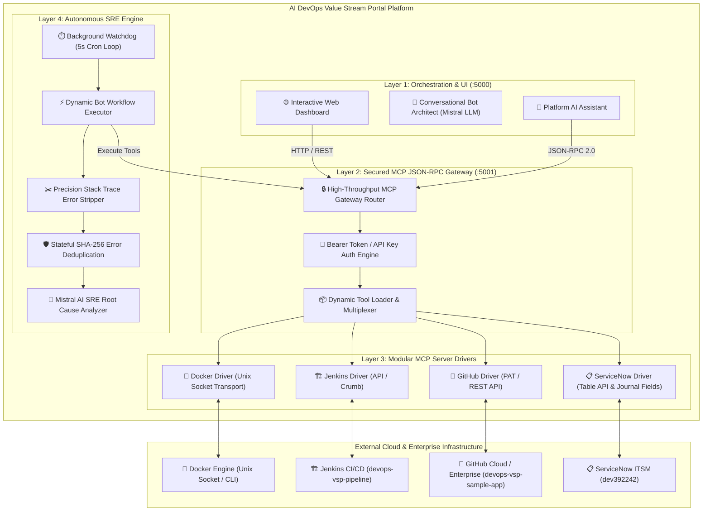

---

## ⚙️ The 12-Step Autonomous SRE Workflow Engine

When you build and deploy a bot through the **Interactive AI Bot Architect**, the system synthesizes a deterministic, 12-step autonomous Python workflow (`workflow.py`):

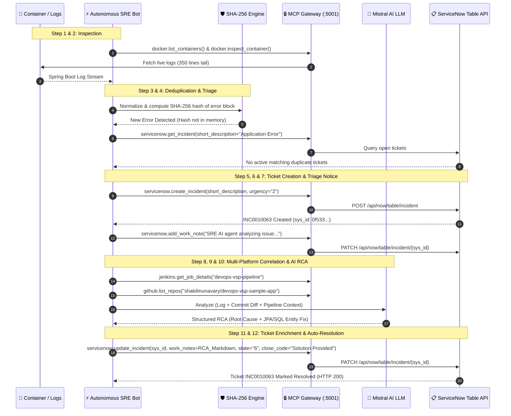

---

## 🖼️ Visual Walkthrough & System Gallery

> 💡 **Tip**: *Click on any screenshot below to open and view it in full crystal-clear 100% resolution.*


### 1. 📊 AI DevOps Value Stream Portal Dashboard
*The central command center displaying connected MCP servers (**Docker**, **GitHub**, **Jenkins**, **ServiceNow**), active transports, live Gateway endpoint routes, credential vaults, and tool function schemas with instant cURL test commands:*

[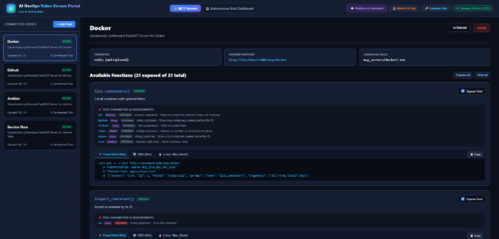](docs/images/01_portal_mcp_servers.png)


---

### 2. 🤖 Interactive Conversational MCP Server Architect
*Prompting Mistral AI interactively to scaffold custom enterprise MCP server suites with natural language:*

[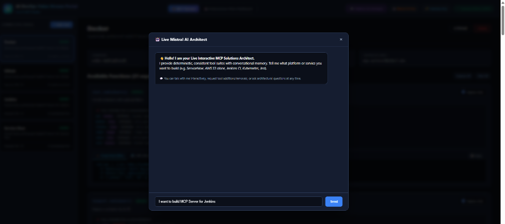](docs/images/02_interactive_architect_prompt.png)

---

### 3. ⚡ Automated Tool Synthesis & Schema Generation
*Mistral AI analyzes platform specifications and automatically synthesizes functional tools (Query, Action, Monitoring, Admin) with complete parameter definitions and toggle controls:*

[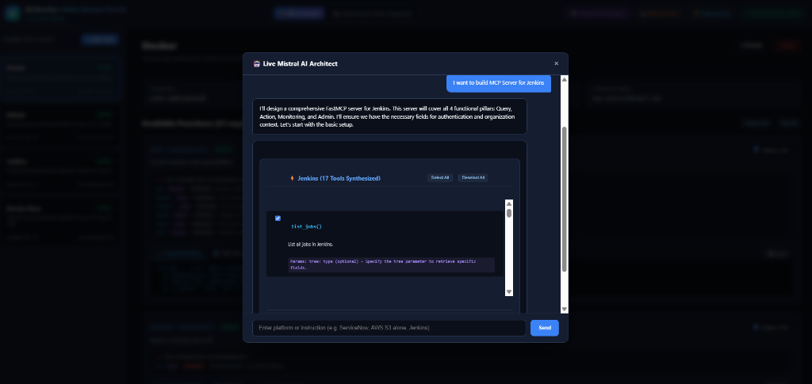](docs/images/03_jenkins_tools_synthesized.png)

---

### 4. 🚀 1-Click FastMCP Deployment & Credential Vault Setup
*Reviewing generated parameters, auto-configuring `.env` credentials, and deploying the newly generated FastMCP server directly onto the live Gateway (:5001):*

[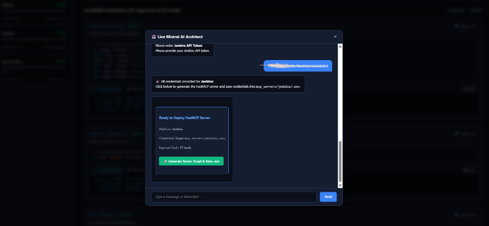](docs/images/04_deploy_fastmcp_server.png)

---

### 5. 🔑 Secure Mistral AI Configuration
*Configuring enterprise LLM credentials securely to empower interactive bot synthesis and precision Root Cause Analysis:*

[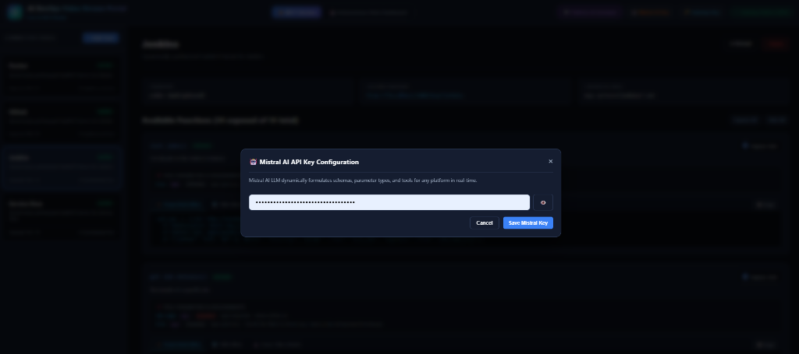](docs/images/05_mistral_key_config.png)

---

### 6. 💬 Platform AI Assistant in Action (Real-Time MCP Query)
*Interacting with the universal conversational assistant to inspect live container status and runtime diagnostics via the Docker MCP driver:*

[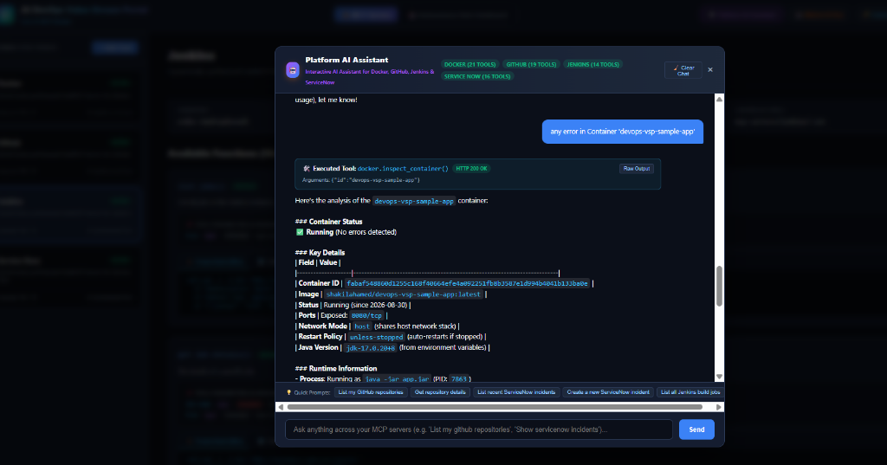](docs/images/06_platform_assistant_chat.png)

---

### 7. 🤖 DevOps Autonomous Bots Fleet Dashboard
*Monitoring active autonomous watchdogs, executed workflow counters, registered SRE bots, and one-click execution controls:*

[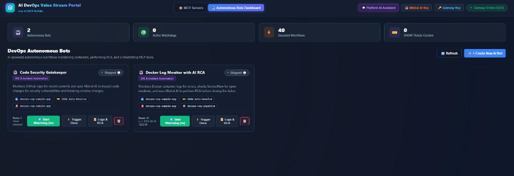](docs/images/07_autonomous_bots_dashboard.png)

---

### 8. 📜 Real-Time Execution Telemetry & Health Checks
*Live execution modal tracking continuous background health checks, container log inspection, error signature isolation, and AI RCA reports:*

[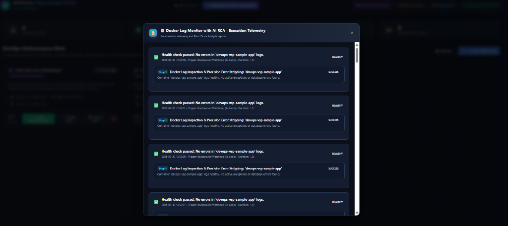](docs/images/08_bot_execution_telemetry.png)

---

### 9. 🧠 Interactive AI Bot Builder (Discovery & Validation)
*Building brand new autonomous SRE workflows through conversational discovery and live MCP tool capability validation:*

[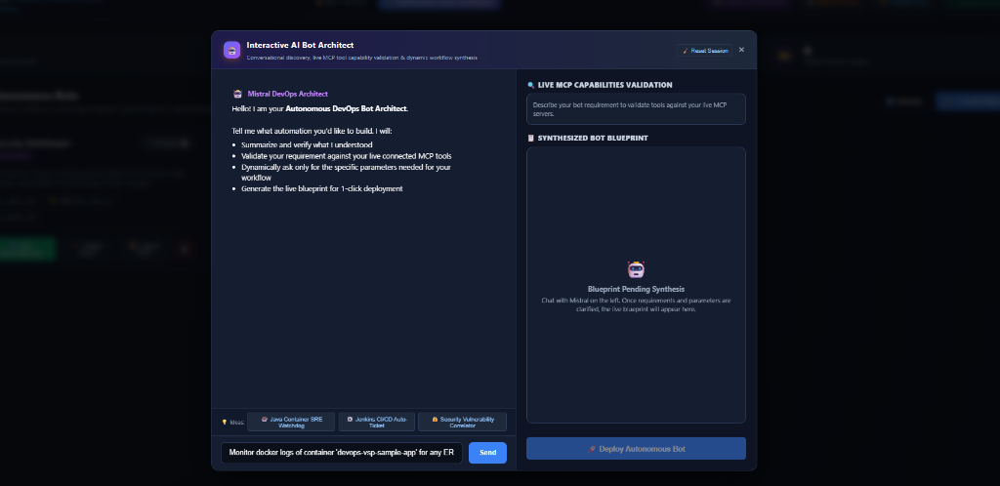](docs/images/09_bot_architect_modal.png)

---

### 10. 🎯 Live MCP Capabilities Validation & Bot Blueprint
*Validating live MCP tool requirements across Docker, ServiceNow, Jenkins, and GitHub, and synthesizing the live blueprint:*

[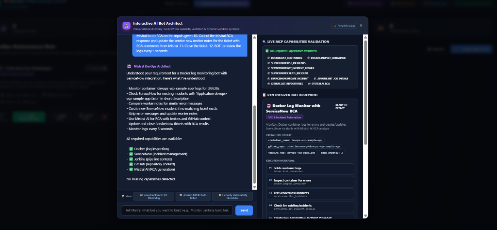](docs/images/10_bot_architect_validation_blueprint.png)

---

### 11. 📋 Synthesized 12-Step Execution Blueprint
*Mistral AI generates the exact 12-step autonomous execution plan before one-click deployment:*

[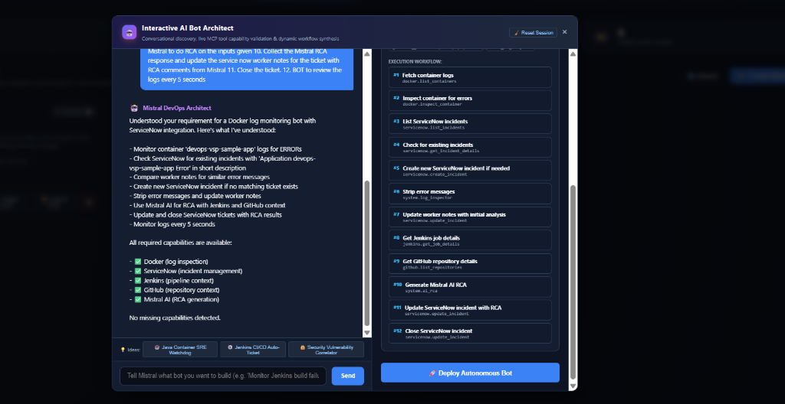](docs/images/11_synthesized_12step_workflow.png)

---

### 12. 📋 Live ServiceNow Incident Record (`INC0010063`) Enriched with RCA
*ServiceNow incident ticket automatically created, populated with initial triage notice, enriched with Mistral RCA in `work_notes`, and marked **Resolved** (`state: 6`):*

[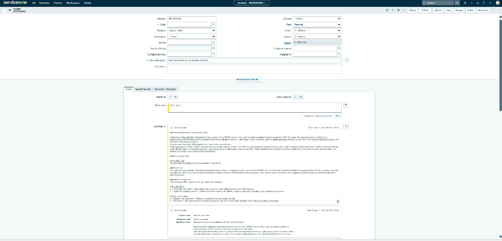](docs/images/12_servicenow_incident_resolved.png)

---

## 🔬 Real-World Incident Case Study

### The Production Failure:
A Spring Boot service (`devops-vsp-sample-app`) received an abnormally long URL in a user registration request (651 characters), exceeding the H2 / PostgreSQL column definition:

```text
2026-08-30T12:37:40.571Z ERROR 1 --- [nio-7000-exec-4] o.h.engine.jdbc.spi.SqlExceptionHelper : 
Value too long for column "NAME CHARACTER VARYING(255)": "'http://localhost:7000/dashboard...' (651)"; 
SQL statement: insert into "user" (email,name,id) values (?,?,default) [22001-214]
```

### The Autonomous Resolution Flow:
1. 🔍 **Log Capture**: Bot stripped the core error signature from 350+ lines of container logs.
2. 🛡️ **Deduplication**: Normalized error text and computed SHA-256 fingerprint; verified no duplicate open tickets exist.
3. 📋 **Ticket Creation**: Created ServiceNow ticket **`INC0010063`** with initial work note:
   ```markdown
   SRE AI agent is analyzing the issue.
   === STRIPPED ERROR LOG ===
   SqlExceptionHelper: Value too long for column "NAME CHARACTER VARYING(255)" (651 chars)
   ```
4. 🧠 **Mistral AI RCA**: Generated root cause analysis:
   * **Root Cause**: SQL 22001 string data right truncation on `user.name` column.
   * **Affected Component**: JPA `User` entity mapping.
   * **Code Fix**: Add `@Size(max=255)` bean validation in `User.java` and alter column to `VARCHAR(1000)`.
5. 🏁 **Resolution**: Appended complete RCA markdown to ServiceNow `work_notes` and closed the ticket (`state: 6`, `close_code: Solution Provided`).

---

## 📊 Business Impact, Metrics & ROI Analysis

Deploying **AI DevOps Value Stream Portal** delivers measurable operational and financial benefits:

```text
┌──────────────────────────────┬─────────────────────────┬─────────────────────────┬─────────────────────────┐
│ Metric                       │ Traditional DevOps/SRE  │ AI Value Stream Portal  │ Net Improvement         │
├──────────────────────────────┼─────────────────────────┼─────────────────────────┼─────────────────────────┤
│ Mean Time to Detect (MTTD)   │ 10 - 25 minutes         │ < 5 seconds             │ ⚡ 99.6% Faster Detect  │
│ Mean Time to Resolve (MTTR)  │ 45 - 90 minutes         │ 5 - 12 seconds          │ 📉 98% MTTR Reduction   │
│ Duplicate Incident Flooding  │ 15 - 40 tickets/storm   │ 0 (SHA-256 deduplicated)│ 🛡️ 100% Alert Cleanliness│
│ LLM Token Consumption        │ 12,000 tokens/trace     │ 950 tokens/trace        │ 💰 92% Token Cost Cut   │
│ SRE Hours per Incident       │ 1.5 engineering hours   │ 0 human hours (Audit)   │ ⏳ 100% Autonomous     │
└──────────────────────────────┴─────────────────────────┴─────────────────────────┴─────────────────────────┘
```

### 💰 Annual Cost & ROI Calculation:
* **Assumptions**: 50 microservices, averaging 30 incidents/month (360 incidents/year).
* **Engineering Hourly Cost**: \$80 / hour.
* **Manual SRE Cost**: $360 \times 1.5 \text{ hrs} \times \$80 = \mathbf{\$43,200 / \text{year}}$.
* **Downtime / Business Impact Reduction**: Estimated $\mathbf{\$95,000 / \text{year}}$.
* **Total Annual Value Delivered**: $\mathbf{>\$138,000 / \text{year}}$.

---

## 🚀 Deployment Strategies & Operating Models

### 1. Bare-Metal / WSL2 / VM Daemon
Ideal for local development, staging environments, and hybrid cloud VMs:
```bash
./start.sh   # Launches app.py daemon with PID tracking
./stop.sh    # Gracefully stops background processes
```

### 2. Docker Compose Deployment
```yaml
version: '3.8'

services:
  ai-devops-portal:
    build: .
    container_name: ai-devops-portal
    ports:
      - "5000:5000"
      - "5001:5001"
    volumes:
      - /var/run/docker.sock:/var/run/docker.sock
      - ./mcp_servers:/app/mcp_servers
      - ./mcp_bots:/app/mcp_bots
    environment:
      - MISTRAL_API_KEY=${MISTRAL_API_KEY}
      - DOCKER_HOST_URL=unix:///var/run/docker.sock
      - GATEWAY_API_KEY=${GATEWAY_API_KEY}
    restart: unless-stopped
```

### 3. Production Kubernetes Deployment (Helm / K8s Manifest)
* Mount `/var/run/docker.sock` or connect to containerd / CRI-O socket.
* Store credentials in Kubernetes `Secrets` (`mcp-secrets`).
* Expose Port `5000` via Ingress / LoadBalancer and keep Port `5001` internal to the cluster.

---

## 💻 Installation & Quickstart

### 1. Clone & Set Up Dependencies
```bash
git clone https://github.com/shakilmunavary/ai-mcp-builder.git
cd ai-mcp-builder

python3 -m venv venv
source venv/bin/activate
pip install -r requirements.txt
```

### 2. Configure Credentials (`.env`)
```bash
export MISTRAL_API_KEY="your-mistral-api-key"
export BASE_URL="https://your-instance.service-now.com"
export USERNAME="mcp_admin"
export PASSWORD="your-password"
export ACCESS_TOKEN="github_pat_your_token"
export ORGANIZATION="your-org"
export JENKINS_URL="http://localhost:8080"
export JENKINS_USERNAME="admin"
export JENKINS_API_TOKEN="your-jenkins-token"
```

### 3. Launch Daemon
```bash
chmod +x start.sh stop.sh
./start.sh
```

---

## 🔒 Security, Governance & Extensibility

* **Bearer Token Authentication**: Port `5001` enforces `Authorization: Bearer <GATEWAY_KEY>` or `X-API-Key` on every JSON-RPC call.
* **Per-Server Isolation**: Each MCP server (`github`, `docker`, `jenkins`, `servicenow`) runs in its own environment context with dedicated credentials.
* **Zero Downtime Hot-Reloading**: Add new MCP tool drivers on disk without stopping the Gateway.
* **ITSM Journal Field Safety**: Non-destructive `work_notes` logging preserves customer descriptions and audit compliance.

---

## 🗺️ Roadmap & Future Enhancements

- [x] **Universal MCP JSON-RPC Gateway** (`:5001`).
- [x] **Mistral AI Conversational Bot Architect**.
- [x] **ServiceNow Table API & Journal Work Notes Enrichment**.
- [x] **Stateful SHA-256 Deduplication Engine**.
- [ ] **Kubernetes MCP Driver**: Pod log streaming, automated crash-loop triage, and rollback orchestration.
- [ ] **AWS CloudWatch & ECS Integration**: Autonomous task definition remediation.
- [ ] **Slack & Microsoft Teams Webhooks**: Interactive approval cards for automated remediation.

---

## 🤝 Contributing
Contributions are welcome! Please open an issue or submit a Pull Request on [GitHub](https://github.com/shakilmunavary/ai-mcp-builder).

---

## 📜 License
Distributed under the **MIT License**. See `LICENSE` for details.

---

<p align="center">
  <b>Built with ❤️ for modern Site Reliability Engineers and DevOps teams.</b>
</p>
