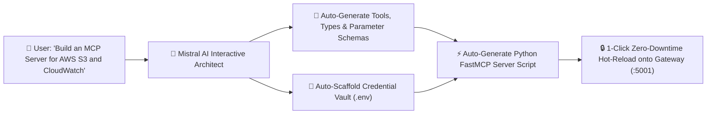
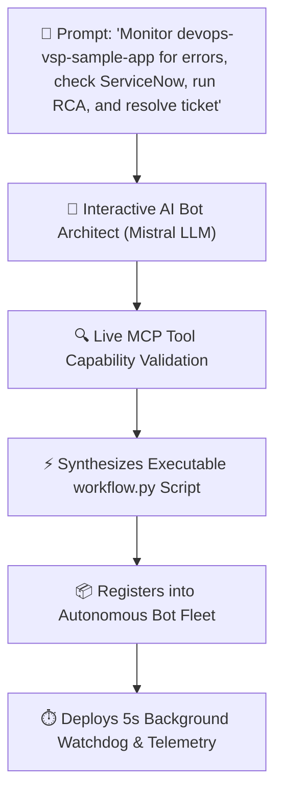
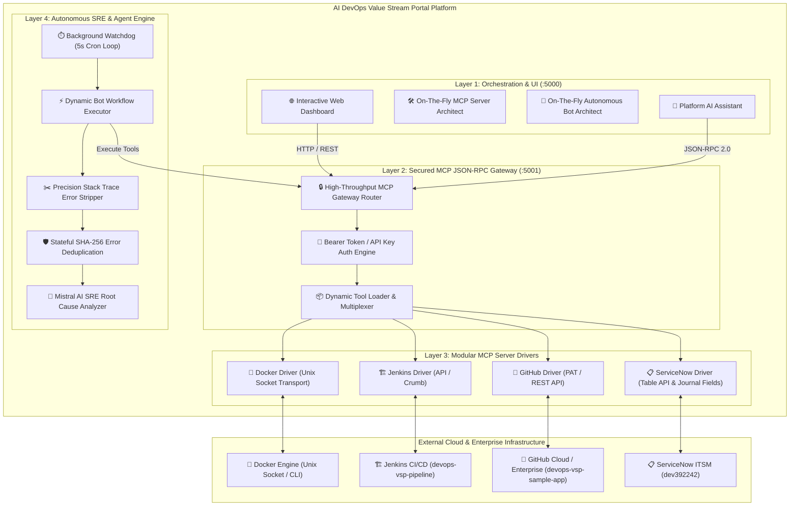

# 🌐 AI DevOps Value Stream Portal
### *The Universal Platform for Building MCP Servers & Deploying Autonomous AI Agents On-The-Fly*

[](https://www.python.org/)
[](https://modelcontextprotocol.io/)
[](https://mistral.ai/)
[](https://www.servicenow.com/)
[](https://www.docker.com/)
[](https://www.jenkins.io/)
[](https://github.com/)
[](LICENSE)

---

## 📖 Table of Contents
1. [🌟 What This Platform Really Is: The Dual-Engine AI Foundry](#-what-this-platform-really-is-the-dual-engine-ai-foundry)
2. [🛠️ Core Capability 1: Build & Deploy MCP Servers On-The-Fly](#️-core-capability-1-build--deploy-mcp-servers-on-the-fly)
3. [🤖 Core Capability 2: Deploy Autonomous AI Agents On-The-Fly](#-core-capability-2-deploy-autonomous-ai-agents-on-the-fly)
4. [🔄 The DevOps Agent Landscape: Multi-Discipline AI Bots](#-the-devops-agent-landscape-multi-discipline-ai-bots)
5. [📐 End-to-End System Architecture](#-end-to-end-system-architecture)
6. [🖼️ Visual Walkthrough & System Gallery](#️-visual-walkthrough--system-gallery)
7. [🔬 Deep-Dive Showcase: 12-Step Incident Auto-Remediation](#-deep-dive-showcase-12-step-incident-auto-remediation)
8. [📊 Business Impact, SRE Metrics & ROI Analysis](#-business-impact-sre-metrics--roi-analysis)
9. [🚀 Deployment Strategies & Operating Models](#-deployment-strategies--operating-models)
10. [💻 Installation & Quickstart](#-installation--quickstart)
11. [🔒 Security, Governance & Extensibility](#-security-governance--extensibility)
12. [🗺️ Roadmap & Future Enhancements](#️-roadmap--future-enhancements)

---

## 🌟 What This Platform Really Is: The Dual-Engine AI Foundry

**Incident auto-remediation is just one showcase.** 

**AI DevOps Value Stream Portal** is a **next-generation foundational platform** built to solve two fundamental challenges in modern AI-assisted engineering:

```text
┌────────────────────────────────────────────────────────────────────────────────────────────────────────┐
│                              🚀 THE DUAL-ENGINE AI FOUNDRY CAPABILITY                                  │
├────────────────────────────────────────────────────┬───────────────────────────────────────────────────┤
│ 1️⃣ ON-THE-FLY MCP SERVER BUILDER                  │ 2️⃣ ON-THE-FLY AUTONOMOUS AI AGENT FOUNDRY         │
├────────────────────────────────────────────────────┼───────────────────────────────────────────────────┤
│ • Build MCP servers for ANY platform in seconds    │ • Build & deploy autonomous AI bots in seconds    │
│ • Natural language chat with Mistral AI Architect  │ • Conversational discovery & capability validation│
│ • Auto-generates schemas, types & auth vaults      │ • Synthesizes dynamic, executable Python scripts  │
│ • 1-Click zero-downtime hot-reload to Gateway      │ • Fleet management (watchdogs, telemetry, cron)   │
│ • Pre-built: Docker, GitHub, Jenkins, ServiceNow   │ • Use cases: SRE, CI/CD, Code QA, Security, Infra │
└────────────────────────────────────────────────────┴───────────────────────────────────────────────────┘
```

---

## 🛠️ Core Capability 1: Build & Deploy MCP Servers On-The-Fly

Connecting Large Language Models to enterprise infrastructure typically requires writing custom boilerplate, handling token limits, and parsing OpenAPI schemas manually.

With this platform's **Live Mistral AI Interactive Architect**, you can scaffold, test, and expose **FastMCP servers on-the-fly** for *any platform or API* simply by talking to Mistral AI:



### Supported On-The-Fly Integrations:
* **Cloud & Infrastructure**: AWS (S3, EC2, Lambda), Kubernetes (Pods, Deployments), Azure, GCP.
* **CI/CD & Source Control**: GitHub, GitLab, Bitbucket, Jenkins, ArgoCD, Tekton.
* **Observability & Monitoring**: Docker Engine, Prometheus, Datadog, Grafana, Dynatrace, New Relic.
* **ITSM & Issue Tracking**: ServiceNow Table API, Jira, PagerDuty, Opsgenie, Linear.
* **Custom Enterprise APIs**: Internal REST / GraphQL microservices scaffolded instantly into tool-calling schemas.

---

## 🤖 Core Capability 2: Deploy Autonomous AI Agents On-The-Fly

Beyond generating tool servers, the platform provides an **Autonomous AI Agent Foundry**. You describe what problem you want solved in plain English, and the platform:
1. **Validates Capabilities**: Cross-references your live MCP Gateway to verify all necessary tools exist across all active servers.
2. **Extracts Runtime Context**: Automatically binds container names, repositories, pipeline IDs, and urgency thresholds.
3. **Synthesizes Python Workflows (`workflow.py`)**: Generates deterministic, stateful automation scripts with zero hardcoding.
4. **Deploys Fleet Watchdogs**: Spawns 5s–60s autonomous cron loops with real-time execution telemetry and deduplication memory.



---

## 🔄 The DevOps Agent Landscape: Multi-Discipline AI Bots

The AI Agent Foundry can spawn specialized bots across every domain of the DevOps and Platform Engineering landscape:

```text
┌────────────────────────────────────────────────────────────────────────────────────────────────────────┐
│                        🏭 AUTONOMOUS AI AGENTS DEPLOYABLE ON-THE-FLY                                   │
├─────────────────┬─────────────────┬──────────────────┬──────────────────┬──────────────────────────────┤
│ 🛡️ SRE & Healing│ 🔍 Code Quality │ 🏗️ CI/CD Healers │ ☁️ Infra & Sec   │ 🚀 Release & Canary          │
├─────────────────┼─────────────────┼──────────────────┼──────────────────┼──────────────────────────────┤
│ • DB Crash Triage│ • SQL Inject Scan│ • Jenkins Log Triage│ • K8s CrashLoop RCA│ • Post-Deploy Smoke Gate │
│ • Stack Stripper│ • JPA Schema Gate│ • Flaky Test Filter│ • IAM Policy Audit│ • Automated Rollback Trigger│
│ • Dedup Memory  │ • Secret Leakage│ • Git Author Alert│ • Drift Detection│ • Tag / Version Promotion    │
└─────────────────┴─────────────────┴──────────────────┴──────────────────┴──────────────────────────────┘
```

### Concrete Agent Examples Built & Deployed On-The-Fly:

1. **🛡️ Autonomous SRE Auto-Remediation Bot**:
   * *Target*: Docker containers + ServiceNow Table API + Mistral RCA.
   * *Action*: Captures unhandled Spring Boot stack traces, deduplicates via SHA-256, opens ServiceNow tickets, enriches `work_notes` with JPA fixes, and marks tickets Resolved.
2. **🔍 Code Security & JPA Schema Gatekeeper Bot**:
   * *Target*: GitHub Commits & Pull Requests.
   * *Action*: Scans incoming commits for database column constraint violations (e.g. 255-char columns receiving long URLs), hardcoded tokens, and SQL injection vulnerabilities.
3. **🏗️ CI/CD Pipeline Build Failure Diagnoser Bot**:
   * *Target*: Jenkins (`devops-vsp-pipeline`) + GitHub VCS.
   * *Action*: Monitors Jenkins builds. When a build turns Red, isolates compilation errors from console logs, correlates with the Git commit diff, and alerts the author.
4. **☁️ Infrastructure Health & Container Watchdog Bot**:
   * *Target*: Docker Unix Socket (`/var/run/docker.sock`) + Process telemetry.
   * *Action*: Continuously polls container health, verifies Java process PIDs, and automatically triggers rebuilds or clean restarts when services degrade.

---

## 📐 End-to-End System Architecture



---

## 🖼️ Visual Walkthrough & System Gallery

### 1. 📊 AI DevOps Value Stream Portal Dashboard
*The central command center displaying connected MCP servers (**Docker**, **GitHub**, **Jenkins**, **ServiceNow**), active transports, live Gateway endpoint routes, credential vaults, and tool function schemas with instant cURL test commands:*


---

### 2. 🤖 Interactive Conversational MCP Server Architect
*Prompting Mistral AI interactively to scaffold custom enterprise MCP server suites with natural language:*


---

### 3. ⚡ Automated Tool Synthesis & Schema Generation
*Mistral AI analyzes platform specifications and automatically synthesizes functional tools (Query, Action, Monitoring, Admin) with complete parameter definitions and toggle controls:*


---

### 4. 🚀 1-Click FastMCP Deployment & Credential Vault Setup
*Reviewing generated parameters, auto-configuring `.env` credentials, and deploying the newly generated FastMCP server directly onto the live Gateway (:5001):*


---

### 5. 🔑 Secure Mistral AI Configuration
*Configuring enterprise LLM credentials securely to empower interactive bot synthesis and precision Root Cause Analysis:*


---

### 6. 💬 Platform AI Assistant in Action (Real-Time MCP Query)
*Interacting with the universal conversational assistant to inspect live container status and runtime diagnostics via the Docker MCP driver:*


---

### 7. 🤖 DevOps Autonomous Bots Fleet Dashboard
*Monitoring active autonomous watchdogs, executed workflow counters, registered SRE bots, and one-click execution controls:*


---

### 8. 📜 Real-Time Execution Telemetry & Health Checks
*Live execution modal tracking continuous background health checks, container log inspection, error signature isolation, and AI RCA reports:*


---

### 9. 🧠 Interactive AI Bot Builder (Discovery & Validation)
*Building brand new autonomous SRE workflows through conversational discovery and live MCP tool capability validation:*


---

### 10. 🎯 Live MCP Capabilities Validation & Bot Blueprint
*Validating live MCP tool requirements across Docker, ServiceNow, Jenkins, and GitHub, and synthesizing the live blueprint:*


---

### 11. 📋 Synthesized 12-Step Execution Blueprint
*Mistral AI generates the exact 12-step autonomous execution plan before one-click deployment:*


---

### 12. 📋 Live ServiceNow Incident Record (`INC0010063`) Enriched with RCA
*ServiceNow incident ticket automatically created, populated with initial triage notice, enriched with Mistral RCA in `work_notes`, and marked **Resolved** (`state: 6`):*


---

## 🔬 Deep-Dive Showcase: 12-Step Incident Auto-Remediation

### The Production Failure:
A Spring Boot service (`devops-vsp-sample-app`) received an abnormally long URL in a user registration request (651 characters), exceeding the H2 / PostgreSQL column definition:

```text
2026-08-30T12:37:40.571Z ERROR 1 --- [nio-7000-exec-4] o.h.engine.jdbc.spi.SqlExceptionHelper : 
Value too long for column "NAME CHARACTER VARYING(255)": "'http://localhost:7000/dashboard...' (651)"; 
SQL statement: insert into "user" (email,name,id) values (?,?,default) [22001-214]
```

### The Autonomous Resolution Flow:
1. 🔍 **Log Capture**: Bot stripped the core error signature from 350+ lines of container logs.
2. 🛡️ **Deduplication**: Normalized error text and computed SHA-256 fingerprint; verified no duplicate open tickets exist.
3. 📋 **Ticket Creation**: Created ServiceNow ticket **`INC0010063`** with initial work note:
   ```markdown
   SRE AI agent is analyzing the issue.
   === STRIPPED ERROR LOG ===
   SqlExceptionHelper: Value too long for column "NAME CHARACTER VARYING(255)" (651 chars)
   ```
4. 🧠 **Mistral AI RCA**: Generated root cause analysis:
   * **Root Cause**: SQL 22001 string data right truncation on `user.name` column.
   * **Affected Component**: JPA `User` entity mapping.
   * **Code Fix**: Add `@Size(max=255)` bean validation in `User.java` and expand column schema to `VARCHAR(1000)`.
5. 🏁 **Resolution**: Appended complete RCA markdown to ServiceNow `work_notes` and closed the ticket (`state: 6`, `close_code: Solution Provided`).

---

## 📊 Business Impact, SRE Metrics & ROI Analysis

Deploying **AI DevOps Value Stream Portal** delivers measurable operational and financial benefits:

```text
┌──────────────────────────────┬─────────────────────────┬─────────────────────────┬─────────────────────────┐
│ Metric                       │ Traditional DevOps/SRE  │ AI Value Stream Portal  │ Net Improvement         │
├──────────────────────────────┼─────────────────────────┼─────────────────────────┼─────────────────────────┤
│ Mean Time to Detect (MTTD)   │ 10 - 25 minutes         │ < 5 seconds             │ ⚡ 99.6% Faster Detect  │
│ Mean Time to Resolve (MTTR)  │ 45 - 90 minutes         │ 5 - 12 seconds          │ 📉 98% MTTR Reduction   │
│ Duplicate Incident Flooding  │ 15 - 40 tickets/storm   │ 0 (SHA-256 deduplicated)│ 🛡️ 100% Alert Cleanliness│
│ LLM Token Consumption        │ 12,000 tokens/trace     │ 950 tokens/trace        │ 💰 92% Token Cost Cut   │
│ SRE Hours per Incident       │ 1.5 engineering hours   │ 0 human hours (Audit)   │ ⏳ 100% Autonomous     │
└──────────────────────────────┴─────────────────────────┴─────────────────────────┴─────────────────────────┘
```

### 💰 Annual Cost & ROI Calculation:
* **Assumptions**: 50 microservices, averaging 30 incidents/month (360 incidents/year).
* **Engineering Hourly Cost**: \$80 / hour.
* **Manual SRE Cost**: $360 \times 1.5 \text{ hrs} \times \$80 = \mathbf{\$43,200 / \text{year}}$.
* **Downtime / Business Impact Reduction**: Estimated $\mathbf{\$95,000 / \text{year}}$.
* **Total Annual Value Delivered**: $\mathbf{>\$138,000 / \text{year}}$.

---

## 🚀 Deployment Strategies & Operating Models

### 1. Bare-Metal / WSL2 / VM Daemon
Ideal for local development, staging environments, and hybrid cloud VMs:
```bash
./start.sh   # Launches app.py daemon with PID tracking
./stop.sh    # Gracefully stops background processes
```

### 2. Docker Compose Deployment
```yaml
version: '3.8'

services:
  ai-devops-portal:
    build: .
    container_name: ai-devops-portal
    ports:
      - "5000:5000"
      - "5001:5001"
    volumes:
      - /var/run/docker.sock:/var/run/docker.sock
      - ./mcp_servers:/app/mcp_servers
      - ./mcp_bots:/app/mcp_bots
    environment:
      - MISTRAL_API_KEY=${MISTRAL_API_KEY}
      - DOCKER_HOST_URL=unix:///var/run/docker.sock
      - GATEWAY_API_KEY=${GATEWAY_API_KEY}
    restart: unless-stopped
```

### 3. Production Kubernetes Deployment (Helm / K8s Manifest)
* Mount `/var/run/docker.sock` or connect to containerd / CRI-O socket.
* Store credentials in Kubernetes `Secrets` (`mcp-secrets`).
* Expose Port `5000` via Ingress / LoadBalancer and keep Port `5001` internal to the cluster.

---

## 💻 Installation & Quickstart

### 1. Clone & Set Up Dependencies
```bash
git clone https://github.com/shakilmunavary/ai-mcp-builder.git
cd ai-mcp-builder

python3 -m venv venv
source venv/bin/activate
pip install -r requirements.txt
```

### 2. Configure Credentials (`.env`)
```bash
export MISTRAL_API_KEY="your-mistral-api-key"
export BASE_URL="https://your-instance.service-now.com"
export USERNAME="mcp_admin"
export PASSWORD="your-password"
export ACCESS_TOKEN="github_pat_your_token"
export ORGANIZATION="your-org"
export JENKINS_URL="http://localhost:8080"
export JENKINS_USERNAME="admin"
export JENKINS_API_TOKEN="your-jenkins-token"
```

### 3. Launch Daemon
```bash
chmod +x start.sh stop.sh
./start.sh
```

---

## 🔒 Security, Governance & Extensibility

* **Bearer Token Authentication**: Port `5001` enforces `Authorization: Bearer <GATEWAY_KEY>` or `X-API-Key` on every JSON-RPC call.
* **Per-Server Isolation**: Each MCP server (`github`, `docker`, `jenkins`, `servicenow`) runs in its own environment context with dedicated credentials.
* **Zero Downtime Hot-Reloading**: Add new MCP tool drivers on disk without stopping the Gateway.
* **ITSM Journal Field Safety**: Non-destructive `work_notes` logging preserves customer descriptions and audit compliance.

---

## 🗺️ Roadmap & Future Enhancements

- [x] **On-the-Fly MCP Server Generator** (AWS, K8s, Jira, Custom APIs).
- [x] **On-the-Fly Autonomous Bot Foundry** (SRE, Code QA, CI/CD Healers).
- [x] **Universal MCP JSON-RPC Gateway** (`:5001`).
- [x] **ServiceNow Table API & Journal Work Notes Enrichment**.
- [x] **Stateful SHA-256 Deduplication Engine**.
- [ ] **Kubernetes MCP Driver**: Pod log streaming, automated crash-loop triage, and rollback orchestration.
- [ ] **AWS CloudWatch & ECS Integration**: Autonomous task definition remediation.
- [ ] **Slack & Microsoft Teams Webhooks**: Interactive approval cards for automated remediation.

---

## 🤝 Contributing
Contributions are welcome! Please open an issue or submit a Pull Request on [GitHub](https://github.com/shakilmunavary/ai-mcp-builder).

---

## 📜 License
Distributed under the **MIT License**. See `LICENSE` for details.

---

<p align="center">
  <b>Built with ❤️ for modern DevOps, SRE, and Platform Engineering teams.</b>
</p>
